<div align="center">
  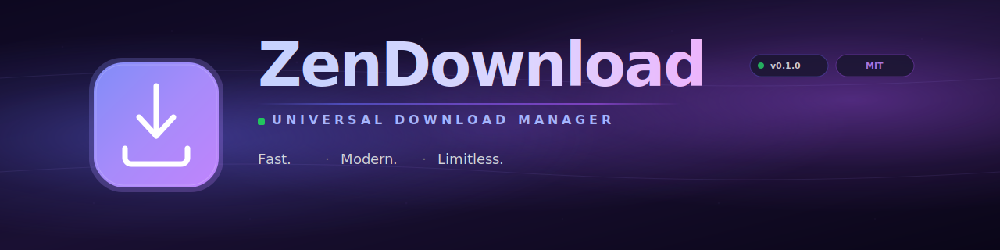

  <br/><br/>

  <p>
    <a href="https://github.com/swadhinbiswas/ZenDownload/releases"></a>
    &nbsp;
    <a href="https://github.com/swadhinbiswas/ZenDownload/blob/main/LICENSE"></a>
    &nbsp;
    <a href="https://github.com/swadhinbiswas/ZenDownload/stargazers"></a>
    &nbsp;
    <a href="https://github.com/swadhinbiswas/ZenDownload/releases/latest/download/ZenDownload_x86_64.AppImage"></a>
  </p>

  <p>
    
    &nbsp;
    
    &nbsp;
    
    &nbsp;
    
    &nbsp;
    
  </p>

  <br/>

  <p>
    <strong>The download manager that actually gets out of your way.</strong><br/>
    HTTP, torrents, videos from 1,462+ sites, music, debrid — all in one beautiful native app.
  </p>

  <p>
    <a href="#-quick-start"><strong>Quick Start</strong></a>
    ·
    <a href="#-features"><strong>Features</strong></a>
    ·
    <a href="#-screenshots"><strong>Screenshots</strong></a>
    ·
    <a href="#-browser-extension"><strong>Browser Extension</strong></a>
    ·
    <a href="#-faq"><strong>FAQ</strong></a>
  </p>
</div>

<br/>

<div align="center">
  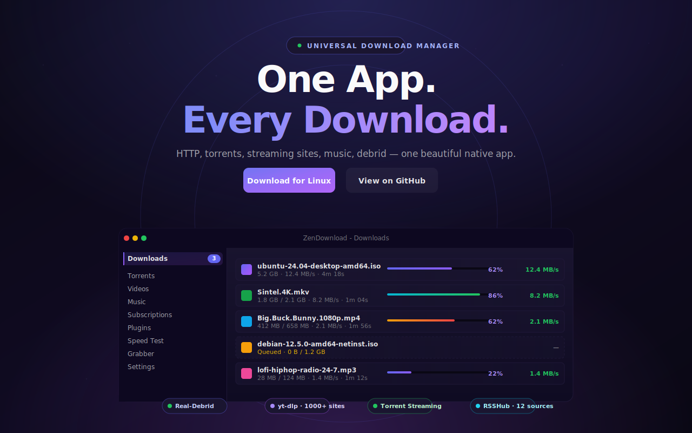
</div>

<br/>

## Why ZenDownload?

<table>
<tr>
<td width="33%" align="center">
  <br/>
  <b>Blazing Fast</b><br/>
  <sub>Multi-threaded segmented downloads with resume. 8 parallel connections per file. Native binary, not Electron.</sub>
</td>
<td width="33%" align="center">
  <br/>
  <b>Universal Capture</b><br/>
  <sub>One extension, every site. YouTube, Twitter/X, Reddit, TikTok, Instagram, Twitch — 1,462+ sites via yt-dlp.</sub>
</td>
<td width="33%" align="center">
  <br/>
  <b>Genuinely Beautiful</b><br/>
  <sub>Dark UI, 12 accent colors, glass effects, compact mode. Designed to be a joy, not a tool you tolerate.</sub>
</td>
</tr>
</table>

<br/>

## Quick Start

### Linux — one-liner installer

```bash
curl -fsSL https://raw.githubusercontent.com/swadhinbiswas/ZenDownload/main/scripts/install.sh | bash
```

Installs the latest AppImage, system dependencies, desktop entry, and `zendown://` protocol handler. Done.

### Other platforms

<table>
<tr>
<th>Platform</th>
<th>Get it</th>
</tr>
<tr>
<td>&nbsp; <b>Windows</b></td>
<td>Download <code>.msi</code> or <code>.exe</code> from <a href="https://github.com/swadhinbiswas/ZenDownload/releases/latest">Releases</a></td>
</tr>
<tr>
<td>&nbsp; <b>macOS</b></td>
<td>Download <code>.dmg</code> from <a href="https://github.com/swadhinbiswas/ZenDownload/releases/latest">Releases</a> (Apple Silicon + Intel)</td>
</tr>
<tr>
<td>&nbsp; <b>Linux (manual)</b></td>
<td>Grab the <code>.AppImage</code>, <code>.deb</code>, or <code>.rpm</code> from <a href="https://github.com/swadhinbiswas/ZenDownload/releases/latest">Releases</a></td>
</tr>
<tr>
<td>&nbsp; <b>From source</b></td>
<td>

```bash
git clone https://github.com/swadhinbiswas/ZenDownload.git
cd zendownload
bun install
bun run tauri dev      # dev with hot reload
bun run tauri build    # production build
```

</td>
</tr>
</table>

<br/>

## Features

### Download Engine

<table>
<tr>
<td width="50%" valign="top">

**Multi-protocol**  
HTTP, HTTPS, BitTorrent, magnet links, HLS, DASH, IPTV playlists. One engine, every protocol.

</td>
<td width="50%" valign="top">

**Streaming media**  
Extract video & audio from **1,462+ sites** via yt-dlp — YouTube, Twitter/X, Reddit, TikTok, Instagram, Twitch, Vimeo, SoundCloud, Rumble, Bitchute, and more.

</td>
</tr>
<tr>
<td valign="top">

**Multi-threaded HTTP**  
Segmented downloads, 8 parallel connections per file, automatic resume, bandwidth profiles.

</td>
<td valign="top">

**Smart URL routing**  
Every URL is HEAD-probed to decide direct vs streaming. No host lists to maintain — it just works.

</td>
</tr>
<tr>
<td valign="top">

**Torrent engine**  
Full librqbit integration: DHT, PEX, magnet resolution, multi-tracker, sequential streaming playback.

</td>
<td valign="top">

**Debrid services**  
Real-Debrid, AllDebrid, Premiumize. Drop your API key in Settings — premium links auto-resolve.

</td>
</tr>
<tr>
<td valign="top">

**HLS / DASH / M3U8**  
Adaptive bitrate streams download natively. Watch while downloading on supported formats.

</td>
<td valign="top">

**Music downloader**  
Search YouTube & SoundCloud, download with album art and full ID3 metadata embedded.

</td>
</tr>
</table>

### Queue & Automation

<table>
<tr>
<td width="50%" valign="top">
&nbsp; <b>Smart queue</b><br/>
Auto-promotes downloads, configurable concurrency (1–3 simultaneous), pause/resume per file.
</td>
<td width="50%" valign="top">
&nbsp; <b>Clipboard monitor</b><br/>
Auto-detects URLs copied to clipboard with category preview before you even paste.
</td>
</tr>
<tr>
<td valign="top">
&nbsp; <b>Watch folders</b><br/>
Point at a directory — new files are auto-added to the queue.
</td>
<td valign="top">
&nbsp; <b>Scheduler</b><br/>
Time-based download windows. Throttle bandwidth at night, full speed during the day.
</td>
</tr>
<tr>
<td valign="top">
&nbsp; <b>Subscriptions</b><br/>
RSS, RSSHub, YouTube channels. Browse 1,800+ routes and subscribe with one click.
</td>
<td valign="top">
&nbsp; <b>Batch import</b><br/>
Paste a list, auto-detect type, queue them all. Perfect for grabbing a season of episodes.
</td>
</tr>
</table>

### Organization

<table>
<tr>
<td width="50%" valign="top">
&nbsp; <b>Category routing</b><br/>
Auto-save into Video, Music, Documents, Compressed, Programs folders based on file type.
</td>
<td width="50%" valign="top">
&nbsp; <b>History & search</b><br/>
Complete history with search, statistics, retry, and one-click re-download.
</td>
</tr>
<tr>
<td valign="top">
&nbsp; <b>File preview</b><br/>
Preview videos, audio, images, text, and PDFs in-app before opening externally.
</td>
<td valign="top">
&nbsp; <b>Cookie import</b><br/>
Pull cookies from Chrome, Firefox, Edge, Opera, Brave for authenticated downloads.
</td>
</tr>
</table>

### User Interface

<table>
<tr>
<td width="50%" valign="top">
&nbsp; <b>12 accent colors</b><br/>
Indigo, blue, purple, pink, red, orange, amber, emerald, teal, cyan, slate, zinc. Match your wallpaper.
</td>
<td width="50%" valign="top">
&nbsp; <b>Background density</b><br/>
Solid, glass (frosted blur), or transparent. Adjust corner radius from square to pill-shaped.
</td>
</tr>
<tr>
<td valign="top">
&nbsp; <b>Speed test</b><br/>
Built-in multi-server test with live graph. Diagnose slow connections in seconds.
</td>
<td valign="top">
&nbsp; <b>System tray</b><br/>
Minimize to tray, quick actions, live badge for active downloads, native notifications.
</td>
</tr>
</table>

### Advanced

<table>
<tr>
<td width="50%" valign="top">
&nbsp; <b>Proxy support</b><br/>
HTTP, HTTPS, SOCKS5 with authentication. Per-download or global.
</td>
<td width="50%" valign="top">
&nbsp; <b>Bandwidth profiles</b><br/>
Per-download and global speed limits. Schedule them to switch automatically.
</td>
</tr>
<tr>
<td valign="top">
&nbsp; <b>Multi-language</b><br/>
i18n with 15+ languages. Settings backup and restore built-in.
</td>
<td valign="top">
&nbsp; <b>Cloud mirroring</b><br/>
Sync completed downloads to Google Drive automatically.
</td>
</tr>
</table>

<br/>

## Screenshots

<div align="center">

### Download Manager
*Active queue with multi-protocol downloads, live stats, and per-file controls.*

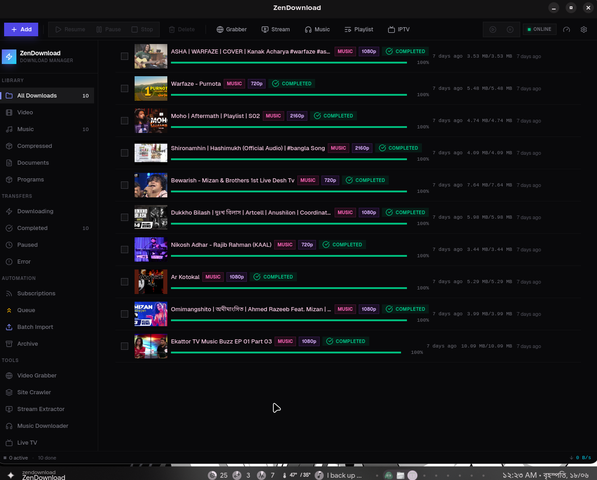

<br/>

### Torrent Streaming
*Stream while seeding — full librqbit engine with peer management.*

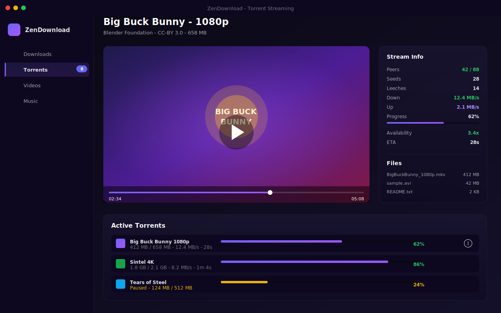

<br/>

### Capture &amp; Grab
*Batch import, site grabber, full-site grabber, and stream detection.*

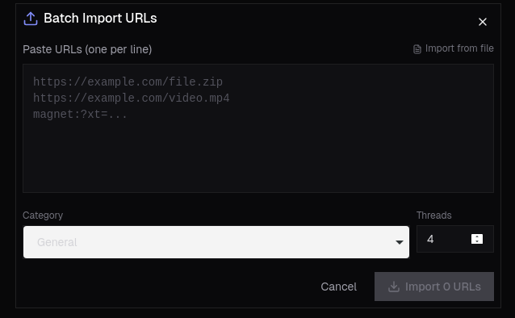
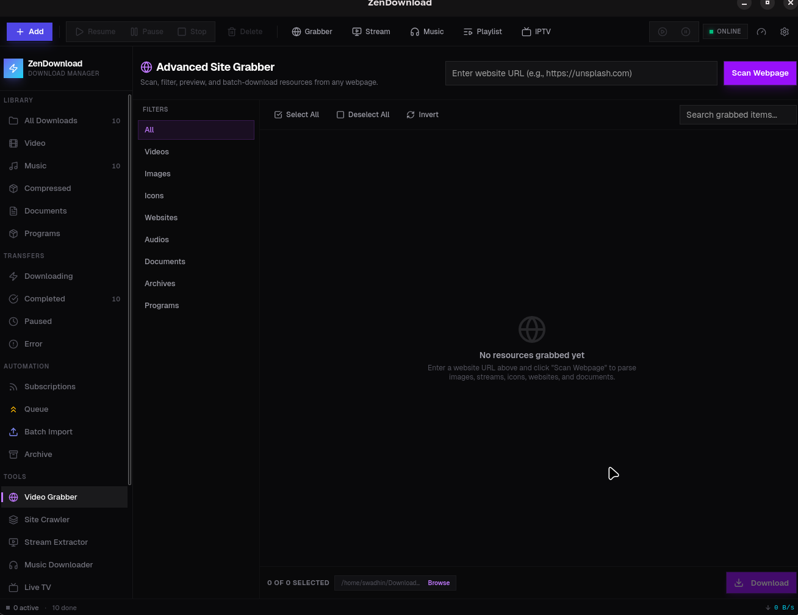
<br/>
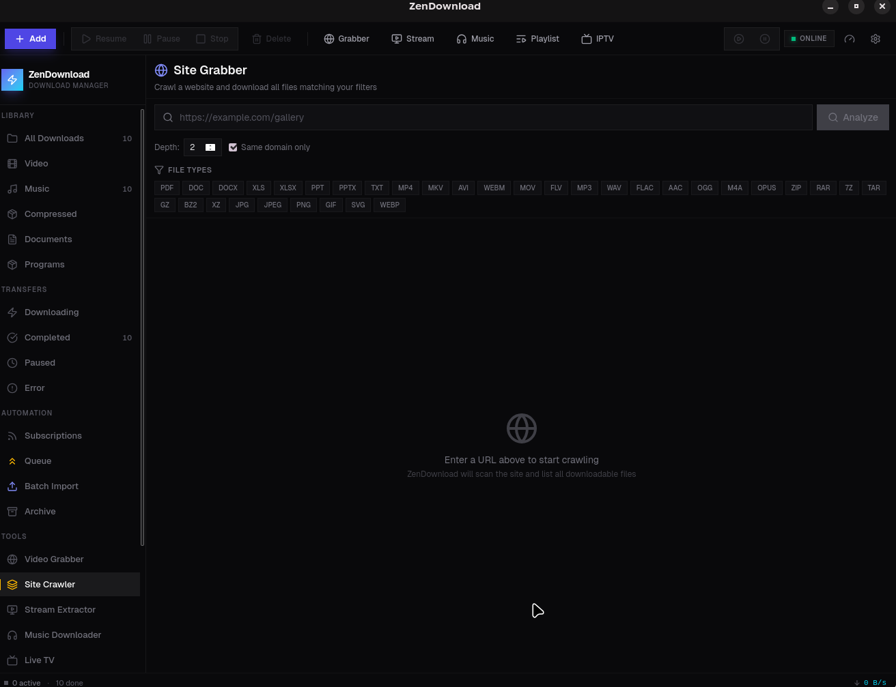
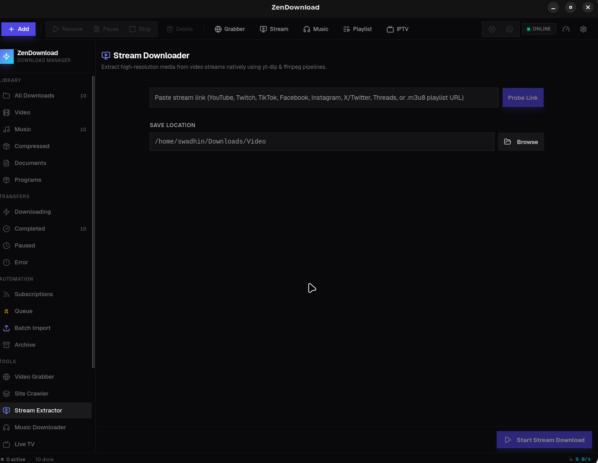

<br/>

### Music &amp; Playlists
*Search YouTube and SoundCloud, download with full ID3 metadata and cover art.*

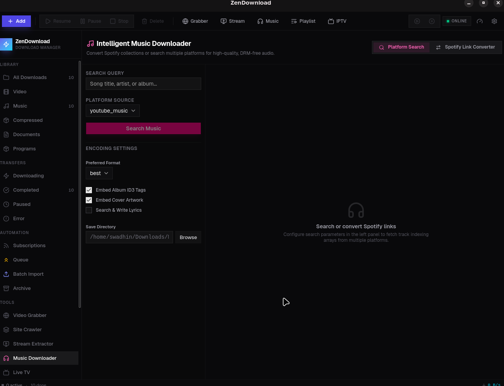
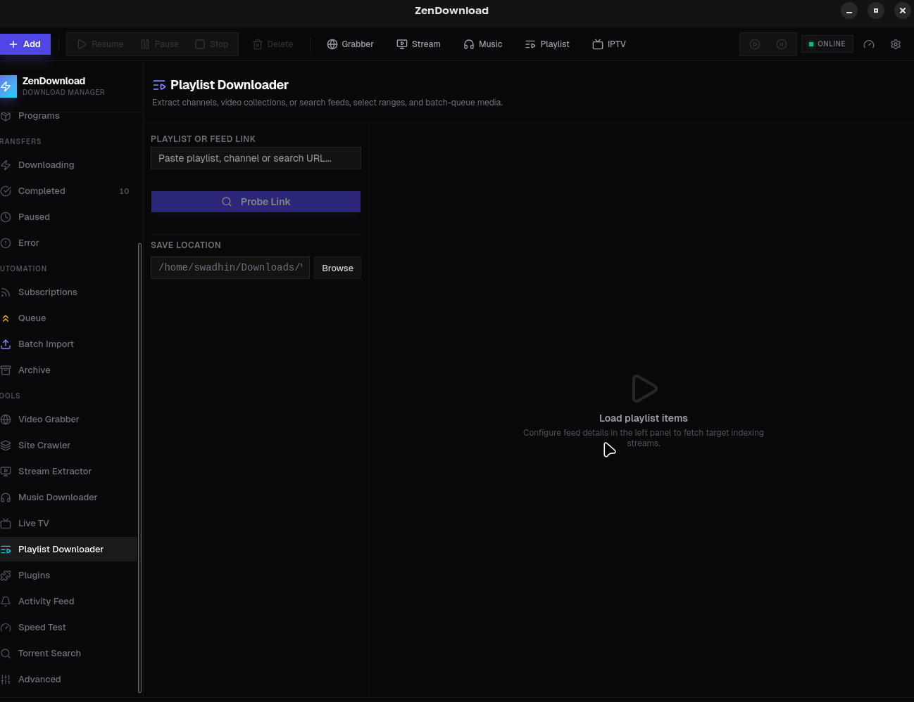

<br/>

### Live TV &amp; Subscriptions
*IPTV channels, RSS feeds, and automated profiling rules.*

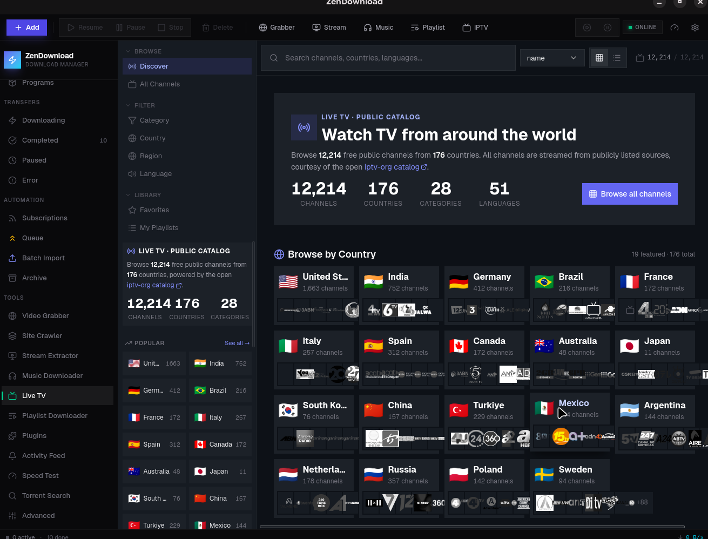
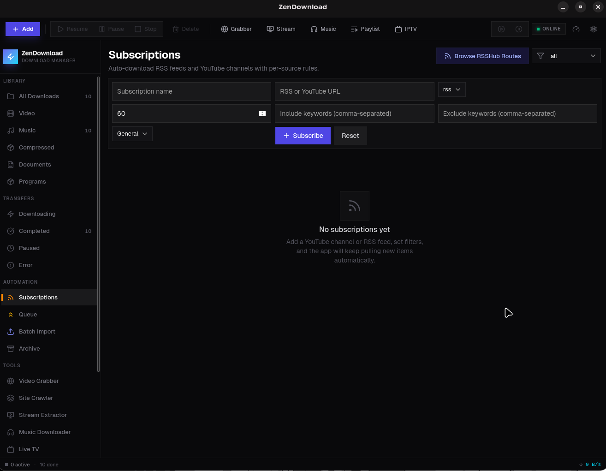
<br/>
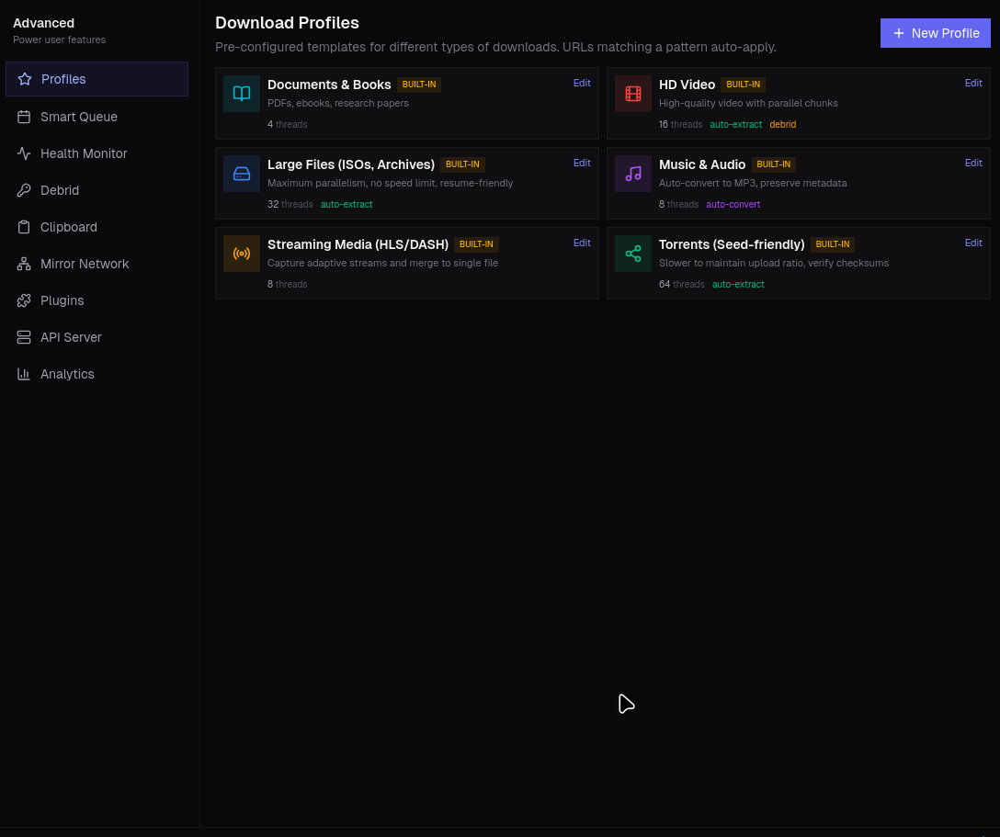
&nbsp;

<br/>

### Settings &amp; Theming
*12 accent colors, glass effects, adjustable corner radius — make it yours.*

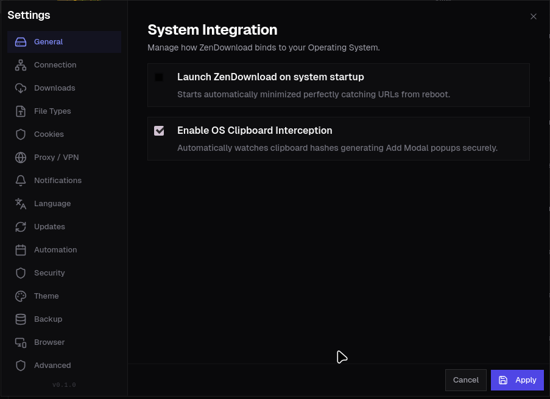

<br/>

### Browser Extension
*Floating download button and captured media panel on any website.*

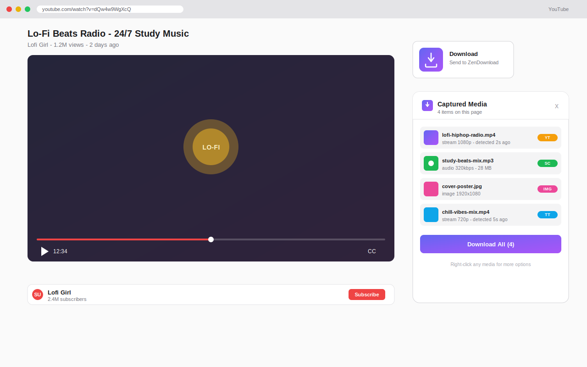

</div>

<br/>

## Browser Extension

The companion extension makes ZenDownload aware of every video, audio, and download link on every page you visit.

**Install:** load `extension/` as an unpacked extension in Chrome / Edge / Brave / Firefox.

**What it does:**

- &nbsp; **Floating button** on any `<video>` or `<audio>` — hover, click, sent to desktop
- &nbsp; **Quality picker** — pick 4K, 1080p, 720p, or audio-only before downloading
- &nbsp; **Network sniffing** — captures streaming media URLs from page requests
- &nbsp; **Shadow DOM traversal** — works with Video.js, JW Player, Plyr, embedded players
- &nbsp; **`zendown://` protocol** — one-click send with full metadata (cookies, format, page URL)
- &nbsp; **Right-click menu** — "Download with ZenDownload" on links, images, videos, audio
- &nbsp; **Captured media panel** — see all detected URLs on the page, filter and download all

**How it works:**

```
Browser page  ──►  Content script detects media
        │
        ├─► Floating button (hover <video>/<audio>)
        ├─► Link panel (all <a href> on page)
        └─► webRequest sniffer (auto-detect)
        │
        ▼
   background.js
        │
        ├─► Native messaging (com.zendownload.host)
        └─► HTTP POST → localhost:9527/api/downloads
                              │
                              ▼
                       ZenDownload queue
```

<br/>

## Plugin System

Extend ZenDownload without forking it. Plugins are JSON manifests with optional frontend assets — drop them in the plugins folder or install from the in-app Plugin Store.

```json
{
  "id": "discord-webhook",
  "name": "Discord Notifier",
  "version": "1.0.0",
  "plugin_type": "webhook",
  "hooks": ["download.complete"],
  "config": { "webhook_url": "" },
  "icon": "🔔",
  "category": "notification"
}
```

**Hook-based events:** `download.start`, `download.complete`, `download.error`, `url.extract`, `file.postprocess`, `clipboard.detect`

**UI plugins** can register sidebar entries and render custom pages (radio, RSS reader, media player, notes, etc.).

See [docs/PLUGIN_DEVELOPMENT.md](docs/PLUGIN_DEVELOPMENT.md) for the full guide.

<br/>

## What people use it for

> *"Replaced IDM, JDownloader, and qBittorrent in one go. The browser extension alone is worth it."*

> *"Watched a 4K YouTube video get downloaded and organized into my Movies folder while I made coffee."*

> *"The clipboard monitor caught a magnet link I'd forgotten I'd copied. It just appeared in the queue."*

> *"Torrents stream before they finish downloading. Genuinely didn't know I needed this."*

<br/>

## FAQ

**How is this different from IDM / JDownloader?**  
ZenDownload is a native desktop app (Tauri 2, not Electron), has built-in torrent streaming, supports 1,462+ streaming sites via yt-dlp, and ships a browser extension with universal video detection and quality selection — all in a modern dark UI.

**Does it support magnet links?**  
Yes. Paste a magnet link and the engine resolves it via DHT/trackers. Sequential streaming playback is built in.

**Can I use Real-Debrid / AllDebrid / Premiumize?**  
Yes. Add your API key in Advanced Settings. Premium links auto-resolve before queuing.

**Why are speeds lower than my connection's max?**  
The default is 3 concurrent downloads × 8 connections each. Use the built-in Speed Test to confirm your baseline, then tune in Connection Settings.

**How does the `zendown://` protocol work?**  
The browser extension builds a URL like `zendown://add?url=...&cookies=...&format=...` and opens it. The desktop app receives it directly — no REST API roundtrip, no copy-paste.

**Does it work offline?**  
Once installed, the desktop app works fully offline. yt-dlp updates, RSSHub routes, and YouTube channel subscriptions need network access.

**Is my data private?**  
Everything is local. No telemetry, no analytics, no cloud accounts. The app talks to the internet only when you download something.

**Can I theme it?**  
12 accent colors, 3 background densities, adjustable corner radius, font size presets, compact mode. Plus full dark/light theme support.

<br/>

## Contributing

Pull requests, bug reports, and feature ideas are all welcome. See [CONTRIBUTING.md](CONTRIBUTING.md) for the workflow.

Plugin authors — the Plugin Store is open. Ship something useful and we'll feature it.

<br/>

## License

MIT © [swadhinbiswas](https://github.com/swadhinbiswas)

<br/>

<div align="center">
  <sub>Built with Tauri 2 · React 19 · Rust · yt-dlp · librqbit</sub>
</div>
